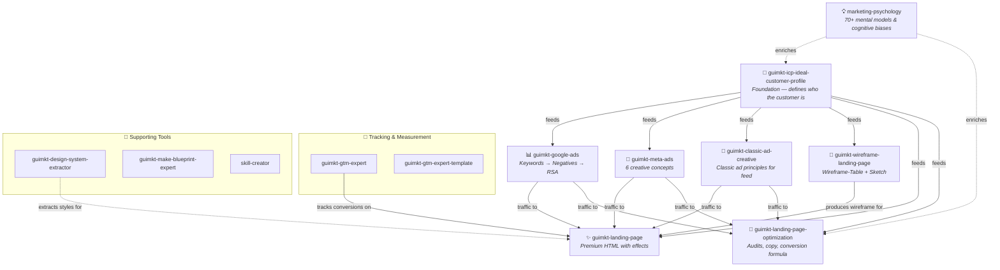
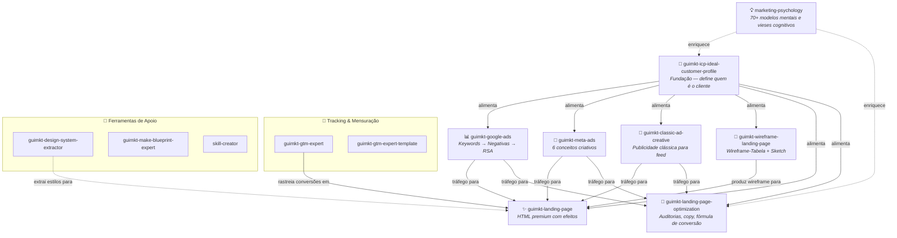

<p align="center">
  <h1 align="center">🧠 ESC Skills - Estrategista Social Club</h1>
  <p align="center">
    <strong>70+ AI agent skills for digital marketing professionals who think like strategists.</strong>
  </p>
</p>

<p align="center">
  <a href="#english">English</a> · <a href="#português">Português</a>
</p>

<p align="center">
  
  
  
  
</p>

---

<a name="english"></a>

## 🇺🇸 English

A collection of 70+ AI agent skills (Gemini, Claude, Cursor, GPT, Windsurf, Cline, Antigravity, Trae, Manus, and more) built for digital marketing professionals: CRO, SEO, Google Ads, Meta Ads, Performance Marketing, Google Tag Manager & Advanced Tracking, Design, Web Development, Security & Architecture, and DevOps.

Built by the [Estrategista Social Club](https://comunidade.gui.marketing/esc) — the club where marketing professionals learn to think, test, and convert like strategists — not like button pushers.

Strategic content, real-world analysis, high-level discussions, and zero bullshit for those who take marketing seriously (as a lifelong career).

> **Methodology tested with 100+ clients. R$400MI+ in sales influenced.**

---

### 📑 Table of Contents

- [What Are Skills?](#what-are-skills)
- [How Skills Connect](#-how-skills-connect)
- [Why Star This Repo?](#-why-star-this-repo)
- [Featured Skills](#-featured-skills)
- [All Available Skills (70+)](#-all-available-skills-70)
- [Quick Start](#-quick-start)
- [AI Agent Setup](#-ai-agent-setup)
- [Updates](#-updates)
- [Star History](#-star-history)

---

### What Are Skills?

**Before skills:** You write long, detailed prompts from scratch every time. The agent gives generic output. You spend more time editing the result than you would doing the work yourself.

**After skills:** You load one file and the agent becomes a specialist — with methodology, constraints, examples, and quality criteria baked in. Output is structured, consistent, and production-ready.

**The bridge:** A **skill** is a plug-and-play expertise module. It's a folder with a `SKILL.md` file (plus optional references, scripts, and assets) that teaches the AI agent _how_ to execute a specific task like a senior professional.

**How they work:**
1. The agent detects the skill is relevant (via trigger keywords) or you load it explicitly
2. The agent reads `SKILL.md` and reference files
3. The agent follows the documented process step-by-step, producing structured deliverables

Works with **any agent that supports file reading** — Gemini, Claude Code, Cursor, GPT, Windsurf, Cline, Antigravity, Trae, Manus, and others.

---

### 🗺️ How Skills Connect

Skills don't work in isolation — they form an interconnected ecosystem. The `guimkt` marketing skills follow a strategic pipeline where the **ICP (Ideal Customer Profile)** feeds every downstream deliverable:



**How to read this map:**
- **Solid arrows** (`→`) = direct dependency (output of one feeds the next)
- **Dashed arrows** (`⇢`) = enrichment (optional but recommended)
- **ICP is the foundation** — run it first, then any combination of downstream skills

> 💡 **Tip:** You don't need to run all skills. Pick the ones you need — the ICP just makes each one better.

---

### ⭐ Why Star This Repo?

- 🆓 **69+ skills, free and open** — years of methodology packed into ready-to-use modules
- 🧪 **Battle-tested** — built from real campaigns with 100+ clients across B2B and B2C
- 🔄 **Frequently updated** — new skills added as the marketing and dev landscape evolves
- 🔔 **Star = notifications** — get notified when new skills drop
- 🤝 **Part of the ESC ecosystem** — backed by the [Estrategista Social Club](https://comunidade.gui.marketing/esc) community

> ⭐ **Star this repo to stay updated with new skills and updates.**

---

### 🏆 Featured Skills

| Skill | What It Does |
|-------|-------------|
| **guimkt-classic-ad-creative** | Full creative concepts for Meta Ads and Google Ads — copy, visual concept, reference sketches |
| **guimkt-classic-ad-creative-final** | Creative concepts for paid media using classic advertising principles adapted to the feed. Static images, carousels, and video scripts |
| **guimkt-design-system-extractor** | Extract complete design systems from any website — colors, typography, components, CSS variables |
| **guimkt-google-ads** | Full Google Ads Search pipeline: Keywords → Negatives → RSA ads (requires ICP). Multi-brand support |
| **guimkt-icp-ideal-customer-profile** | Consolidate the Ideal Customer Profile — 9 dimensions, psychographic profile, real vs. aspirational ICP, mental models. HTML + Markdown output |
| **guimkt-gtm-expert** | Create, edit, and validate GTM container JSON files. Custom HTML, dataLayer, conversion tracking |
| **guimkt-gtm-expert-template** | Customize the GTM Leads 2025 template for new client onboarding. GA4 + Meta Pixel + Google Ads + sGTM |
| **guimkt-landing-page** | Full premium landing pages for lead generation (SQL) in 2 phases: Wireframe-Table (copywriting frameworks) + Premium HTML with liquid glass, micro-animations and scroll effects |
| **guimkt-landing-page-optimization** | Landing Page Optimization — audits, copy frameworks (AIDA, PAS, FAB, BAB), conversion formula C=4m+3v+2(i-f)-2a |
| **guimkt-make-blueprint-expert** | Create, debug, and optimize Make.com scenario blueprints via JSON |
| **guimkt-meta-ads** | 6 complete creative concepts for Meta Ads (Facebook/Instagram) — strategy, copy, visual concept, image prompt and placement adaptations |
| **skill-creator** | Create, test, benchmark, and optimize new AI skills from scratch |
| **ui-ux-pro-max** | UI/UX design intelligence — 50 styles, 21 palettes, 50 font pairings, 9 tech stacks |
| **guimkt-wireframe-landing-page** | Complete landing page wireframes for lead generation (SQL) in 2 phases: Wireframe-Table (copywriting frameworks) + Sketch HTML wireframe for client validation |

---

### 📦 All Available Skills (70+)

| Skill | Description |
|-------|-------------|
| **3d-web-experience** | Three.js, React Three Fiber, Spline, WebGL — 3D web experiences |
| **accessibility** | WCAG 2.1 accessibility audit and improvement |
| **animation-systems** | Product-grade motion à la Stripe, Linear, Apple, Vercel |
| **animejs** | Anime.js v4 — timelines, SVG, scroll, draggable, stagger |
| **aws-advisor** | AWS consulting — architecture, security, implementation |
| **best-practices** | Security, compatibility, and code quality best practices |
| **cloudflare-deploy** | Deploy to Cloudflare Workers, Pages, and services |
| **coding-guidelines** | Behavioral guidelines to reduce common LLM coding mistakes |
| **component-common-domain-detection** | Detect duplicate functionality across components |
| **component-flattening-analysis** | Identify and fix component hierarchy issues |
| **component-identification-sizing** | Identify components and calculate size metrics |
| **confluence-assistant** | Confluence operations via Atlassian MCP |
| **core-web-vitals** | Core Web Vitals optimization (LCP, INP, CLS) |
| **css-border-gradient** | CSS gradient borders with pseudo-element mask |
| **cursor-subagent-creator** | Create subagents for Cursor editor (.cursor/agents/) |
| **decomposition-planning-roadmap** | Monolith decomposition plans and roadmaps |
| **docs-writer** | Documentation writing and review (.md) |
| **domain-analysis** | Identify subdomains and bounded contexts (DDD Strategic Design) |
| **domain-identification-grouping** | Group components into logical domains |
| **feedback-interpreter** | Interpret and apply exported Feedback Studio reviews |
| **figma** | Figma MCP integration — design context, screenshots, assets |
| **figma-implement-design** | Translate Figma nodes into production-ready code (1:1 fidelity) |
| **frontend-design** | Distinctive, production-grade frontend interfaces |
| **frontend-ui-ux** | Designer-turned-developer — stunning UI/UX without mockups |
| **gh-address-comments** | Address review/issue comments on GitHub PRs |
| **gh-fix-ci** | Debug and fix failing GitHub Actions CI checks |
| **gsap** | GSAP — timelines, ScrollTrigger, stagger, transforms |
| **guimkt-classic-ad-creative** | Creative concepts for Meta Ads and Google Ads |
| **guimkt-classic-ad-creative-final** | Creative concepts for paid media — classic advertising principles adapted to the feed |
| **guimkt-design-system-extractor** | Extract complete design systems from websites |
| **guimkt-google-ads** | Google Ads Search for lead generation (SQLs). 3-phase pipeline: Keywords, Negatives, RSA (requires ICP). Multi-brand |
| **guimkt-icp-ideal-customer-profile** | Consolidate Ideal Customer Profile — 9 dimensions, psychographic profile, real vs. aspirational, mental models. HTML + MD output |
| **guimkt-gtm-expert** | Create, edit, validate GTM container JSON files |
| **guimkt-gtm-expert-template** | GTM Leads 2025 template for new clients |
| **guimkt-landing-page** | Full premium landing pages for lead gen — Wireframe-Table + Premium HTML with liquid glass, micro-animations |
| **guimkt-landing-page-optimization** | Landing Page Optimization (LPO) — audits, copy, conversion formula |
| **guimkt-make-blueprint-expert** | Create, debug, and optimize Make.com blueprints via JSON |
| **guimkt-meta-ads** | 6 complete creative concepts for Meta Ads (Facebook/Instagram) — strategy, copy, visual concept, image prompt |
| **interaction-design** | Microinteractions, motion design, transitions |
| **javascript-typescript** | JS/TS with ES6+, Node.js, React, modern frameworks |
| **jira-assistant** | Jira operations via Atlassian MCP |
| **matterjs** | Matter.js — 2D physics, Engine/World, bodies and constraints |
| **netlify-deploy** | Deploy to Netlify via CLI |
| **nx-ci-monitor** | Nx Cloud CI monitor with self-healing |
| **nx-generate** | Generate code with Nx generators |
| **nx-run-tasks** | Run tasks in Nx workspaces |
| **nx-workspace** | Configure and optimize Nx monorepos |
| **perf-astro** | Astro performance for 95+ Lighthouse scores |
| **perf-lighthouse** | Run Lighthouse audits via CLI/Node |
| **perf-web-optimization** | Web optimization — Core Web Vitals, bundles, images, caching |
| **playwright-skill** | Browser automation with Playwright |
| **pricing-page** | High-converting SaaS pricing page design |
| **progressive-blur** | CSS progressive blur with backdrop-filter layers |
| **render-deploy** | Deploy to Render with render.yaml Blueprints |
| **responsive-design** | Responsive layouts — container queries, fluid typography, CSS Grid |
| **run-nx-generator** | Run Nx generators with plugin prioritization |
| **security-best-practices** | Language/framework-specific security reviews |
| **security-ownership-map** | Security ownership topology via git history |
| **security-threat-model** | Repository-grounded threat modeling |
| **sentry** | Inspect Sentry issues and events via API |
| **seo** | SEO optimization — meta tags, structured data, sitemaps |
| **skill-creator** | Guide for creating AI skills (SKILL.md format) |
| **subagent-creator** | Guide for creating subagents with isolated context |
| **technical-design-doc-creator** | Create Technical Design Documents (TDD) |
| **threejs-animation** | Three.js animation — keyframes, skeletal, morph targets |
| **tlc-spec-driven** | 4-phase project planning: Specify, Design, Tasks, Implement |
| **ui-ux-pro-max** | UI/UX intelligence — 50 styles, 21 palettes, 9 stacks |
| **vantajs** | Vanta.js — animated WebGL backgrounds |
| **vercel-deploy** | Deploy to Vercel |
| **web-quality-audit** | Full web quality audit (performance, a11y, SEO) |
| **guimkt-wireframe-landing-page** | Complete landing page wireframes for lead gen — Wireframe-Table + Sketch HTML for client validation |

---

### 🚀 Quick Start

```bash
curl -sL https://raw.githubusercontent.com/guilhermemarketing/esc-skills/main/install.sh | bash
```

<details>
<summary><strong>Other installation methods</strong></summary>

#### Git Submodule

```bash
# Add as submodule (stays synced)
git submodule add https://github.com/guilhermemarketing/esc-skills.git .agent/external-skills

# Update later
git submodule update --remote
```

#### Manual clone

```bash
git clone https://github.com/guilhermemarketing/esc-skills.git /tmp/esc-skills
cp -r /tmp/esc-skills/skills/* .agent/skills/
rm -rf /tmp/esc-skills
```

</details>

---

### 🤖 AI Agent Setup

Add to your `.instructions` or project configuration file:

```markdown
## External Skills
Custom skills are available in `.agent/skills/` (or `.agent/external-skills/skills/` if using submodule).
Before starting any task, check if a relevant skill exists.
Load skills with `view_file` on the corresponding SKILL.md file.
```

---

### 🔄 Updates

New skills are added as the marketing and dev landscape evolves. To stay updated:

- **⭐ Star this repo** — get notified of new releases
- **Submodule:** `git submodule update --remote`
- **Script:** Re-run `install.sh`
- **Clone:** Re-clone the repository

---

### 📈 Star History

[](https://star-history.com/#guilhermemarketing/esc-skills&Date)

---

<a name="português"></a>

## 🇧🇷 Português

Coleção de 70+ skills para agentes AI (Gemini, Claude, Cursor, GPT, Windsurf, Cline, Antigravity, Trae, Manus, etc.) para profissionais de marketing digital: CRO, SEO, Google Ads, Meta Ads, Marketing de Performance, Google Tag Manager & Tracking Avançado, Design, Desenvolvimento Web, Segurança & Arquitetura e DevOps.

Criado pelo [Estrategista Social Club](https://comunidade.gui.marketing/esc) — o clube onde profissionais de marketing aprendem a pensar, testar e converter como estrategistas — não como apertadores de botões.

Conteúdo estratégico, análises reais, discussões de alto nível e zero bullshit para quem leva marketing a sério (como uma carreira pra vida).

> **Metodologia testada com 100+ clientes. R$400MI+ em vendas influenciadas.**

---

### 📑 Sumário

- [O que são Skills?](#o-que-são-skills)
- [Como as Skills se Conectam](#-como-as-skills-se-conectam)
- [Por que dar Star neste Repo?](#-por-que-dar-star-neste-repo)
- [Skills em Destaque](#-skills-em-destaque)
- [Todas as Skills Disponíveis (70+)](#-todas-as-skills-disponíveis-70)
- [Instalação Rápida](#-instalação-rápida)
- [Configuração para Agentes AI](#-configuração-para-agentes-ai)
- [Atualizações](#-atualizações)
- [Star History](#-star-history-1)

---

### O que são Skills?

**Antes das skills:** Você escreve prompts longos e detalhados do zero toda vez. O agente entrega output genérico. Você gasta mais tempo editando o resultado do que gastaria fazendo o trabalho sozinho.

**Depois das skills:** Você carrega um arquivo e o agente se torna um especialista — com metodologia, restrições, exemplos e critérios de qualidade já embutidos. O output é estruturado, consistente e production-ready.

**A ponte:** Uma **skill** é um módulo de expertise plug-and-play. É uma pasta com um arquivo `SKILL.md` (mais referências, scripts e assets opcionais) que ensina o agente AI _como_ executar uma tarefa específica como um profissional sênior.

**Como funcionam:**
1. O agente detecta que a skill é relevante (via keywords de trigger) ou você carrega explicitamente
2. O agente lê o `SKILL.md` e os arquivos de referência
3. O agente segue o processo documentado passo a passo, produzindo deliverables estruturados

Funciona com **qualquer agente que suporte leitura de arquivos** — Gemini, Claude Code, Cursor, GPT, Windsurf, Cline, Antigravity, Trae, Manus e outros.

---

### 🗺️ Como as Skills se Conectam

As skills não funcionam isoladas — elas formam um ecossistema interconectado. As skills `guimkt` de marketing seguem um pipeline estratégico onde o **ICP (Ideal Customer Profile)** alimenta todos os deliverables downstream:



**Como ler este mapa:**
- **Setas sólidas** (`→`) = dependência direta (output de uma alimenta a próxima)
- **Setas tracejadas** (`⇢`) = enriquecimento (opcional mas recomendado)
- **ICP é a fundação** — rode primeiro, depois qualquer combinação de skills downstream

> 💡 **Dica:** Você não precisa rodar todas as skills. Escolha as que precisa — o ICP apenas torna cada uma melhor.

---

### ⭐ Por que dar Star neste Repo?

- 🆓 **69+ skills, grátis e abertas** — anos de metodologia empacotados em módulos prontos para uso
- 🧪 **Testado em batalha** — construído a partir de campanhas reais com 100+ clientes B2B e B2C
- 🔄 **Atualizado frequentemente** — novas skills adicionadas conforme o cenário de marketing e dev evolui
- 🔔 **Star = notificações** — receba alertas quando novas skills forem publicadas
- 🤝 **Parte do ecossistema ESC** — mantido pela comunidade do [Estrategista Social Club](https://comunidade.gui.marketing/esc)

> ⭐ **Dê uma star para ficar atualizado com novas skills.**

---

### 🏆 Skills em Destaque

| Skill | O que faz |
|-------|-----------|
| **guimkt-classic-ad-creative** | Conceitos criativos completos para Meta Ads e Google Ads — copy, conceito visual, sketches de referência |
| **guimkt-classic-ad-creative-final** | Conceitos criativos para mídia paga usando princípios da publicidade clássica adaptados ao feed. Imagens estáticas, carrosséis e roteiros de vídeo |
| **guimkt-design-system-extractor** | Extrai design systems completos de qualquer website — cores, tipografia, componentes, CSS variables |
| **guimkt-google-ads** | Pipeline completo de Google Ads Search: Keywords → Negativas → RSA (requer ICP). Suporta multi-marca |
| **guimkt-icp-ideal-customer-profile** | Consolida o Ideal Customer Profile — 9 dimensões, perfil psicográfico, ICP real vs. aspiracional, modelos mentais. Output HTML + Markdown |
| **guimkt-gtm-expert** | Criar, editar e validar containers GTM JSON. Custom HTML, dataLayer, tracking de conversões |
| **guimkt-gtm-expert-template** | Template GTM Leads 2025 para onboarding de novos clientes. GA4 + Meta Pixel + Google Ads + sGTM |
| **guimkt-landing-page** | Landing pages premium completas para geração de leads (SQL) em 2 fases: Wireframe-Tabela (frameworks de copywriting) + HTML premium com liquid glass, micro-animations e scroll effects |
| **guimkt-landing-page-optimization** | Landing Page Optimization — auditorias, frameworks de copy (AIDA, PAS, FAB, BAB), fórmula de conversão C=4m+3v+2(i-f)-2a |
| **guimkt-make-blueprint-expert** | Criar, debugar e otimizar blueprints de cenários Make.com via JSON |
| **guimkt-meta-ads** | 6 conceitos criativos completos para Meta Ads (Facebook/Instagram) — estratégia, copy, conceito visual, prompt de imagem e adaptações por placement |
| **skill-creator** | Criar, testar, benchmarkar e otimizar novas skills AI do zero |
| **ui-ux-pro-max** | Inteligência UI/UX — 50 estilos, 21 paletas, 50 font pairings, 9 stacks tecnológicos |
| **guimkt-wireframe-landing-page** | Wireframes completos de landing pages para leads (SQL) em 2 fases: Wireframe-Tabela (frameworks de copywriting) + Wireframe-Sketch HTML de baixa fidelidade para validação com clientes |

---

### 📦 Todas as Skills Disponíveis (70+)

| Skill | Descrição |
|-------|-----------|
| **3d-web-experience** | Three.js, React Three Fiber, Spline, WebGL — experiências 3D para web |
| **accessibility** | Audit e melhoria de acessibilidade WCAG 2.1 |
| **animation-systems** | Motion product-grade estilo Stripe, Linear, Apple, Vercel |
| **animejs** | Anime.js v4 — timelines, SVG, scroll, draggable, stagger |
| **aws-advisor** | Consultoria AWS — arquitetura, segurança, implementação |
| **best-practices** | Boas práticas de segurança, compatibilidade e qualidade de código |
| **cloudflare-deploy** | Deploy em Cloudflare Workers, Pages e serviços |
| **coding-guidelines** | Guidelines comportamentais para reduzir erros comuns de LLMs |
| **component-common-domain-detection** | Detecta funcionalidade duplicada entre componentes |
| **component-flattening-analysis** | Identifica e corrige hierarquias de componentes |
| **component-identification-sizing** | Identifica componentes e calcula métricas de tamanho |
| **confluence-assistant** | Operações Confluence via Atlassian MCP |
| **core-web-vitals** | Otimização de Core Web Vitals (LCP, INP, CLS) |
| **css-border-gradient** | Gradient borders CSS com pseudo-element mask |
| **cursor-subagent-creator** | Cria subagents para Cursor editor (.cursor/agents/) |
| **decomposition-planning-roadmap** | Plans e roadmaps de decomposição de monolitos |
| **docs-writer** | Escrita e revisão de documentação (.md) |
| **domain-analysis** | Identifica subdomínios e bounded contexts (DDD Strategic Design) |
| **domain-identification-grouping** | Agrupa componentes em domínios lógicos |
| **feedback-interpreter** | Interpreta e aplica feedbacks exportados do Feedback Studio |
| **figma** | Integração com Figma MCP — design context, screenshots, assets |
| **figma-implement-design** | Traduz nodes Figma em código production-ready (1:1 fidelity) |
| **frontend-design** | Interfaces frontend distintas e production-grade |
| **frontend-ui-ux** | Designer-turned-developer — stunning UI/UX sem mockups |
| **gh-address-comments** | Endereça review/issue comments em PRs do GitHub |
| **gh-fix-ci** | Debug e fix de checks de CI falhando no GitHub Actions |
| **gsap** | GSAP — timelines, ScrollTrigger, stagger, transforms |
| **guimkt-classic-ad-creative** | Conceitos criativos para Meta Ads e Google Ads |
| **guimkt-classic-ad-creative-final** | Conceitos criativos para mídia paga — princípios da publicidade clássica adaptados ao feed |
| **guimkt-design-system-extractor** | Extrai design systems completos de websites |
| **guimkt-google-ads** | Google Ads Search para geração de leads (SQLs). Pipeline de 3 fases: Keywords, Negativas, RSA (requer ICP). Multi-marca |
| **guimkt-icp-ideal-customer-profile** | Consolida o Ideal Customer Profile — 9 dimensões, perfil psicográfico, ICP real vs. aspiracional, modelos mentais. Output HTML + MD |
| **guimkt-gtm-expert** | Criar, editar, validar containers GTM JSON |
| **guimkt-gtm-expert-template** | Template GTM Leads 2025 para novos clientes |
| **guimkt-landing-page** | Landing pages premium para geração de leads — Wireframe-Tabela + HTML premium com liquid glass, micro-animations |
| **guimkt-landing-page-optimization** | Landing Page Optimization (LPO) — auditorias, copy, frameworks de conversão |
| **guimkt-make-blueprint-expert** | Criar, debugar e otimizar blueprints Make.com via JSON |
| **guimkt-meta-ads** | 6 conceitos criativos completos para Meta Ads (Facebook/Instagram) — estratégia, copy, conceito visual, prompt de imagem |
| **interaction-design** | Microinterações, motion design, transições |
| **javascript-typescript** | JS/TS com ES6+, Node.js, React, frameworks modernos |
| **jira-assistant** | Operações Jira via Atlassian MCP |
| **matterjs** | Matter.js — física 2D, Engine/World, bodies e constraints |
| **netlify-deploy** | Deploy em Netlify via CLI |
| **nx-ci-monitor** | Monitor Nx Cloud CI com self-healing |
| **nx-generate** | Gerar código com Nx generators |
| **nx-run-tasks** | Rodar tasks em workspaces Nx |
| **nx-workspace** | Configurar e otimizar monorepos Nx |
| **perf-astro** | Performance Astro para 95+ Lighthouse |
| **perf-lighthouse** | Rodar audits Lighthouse via CLI/Node |
| **perf-web-optimization** | Otimização web — Core Web Vitals, bundle, imagens, cache |
| **playwright-skill** | Automação de browser com Playwright |
| **pricing-page** | Design de pricing pages SaaS de alta conversão |
| **progressive-blur** | Progressive blur CSS com backdrop-filter layers |
| **render-deploy** | Deploy em Render com render.yaml Blueprints |
| **responsive-design** | Layouts responsivos — container queries, fluid typography, CSS Grid |
| **run-nx-generator** | Rodar Nx generators com priorização de plugins |
| **security-best-practices** | Reviews de segurança por linguagem/framework |
| **security-ownership-map** | Topologia de ownership por segurança via git history |
| **security-threat-model** | Threat modeling grounded em repositório |
| **sentry** | Inspecionar issues e eventos Sentry via API |
| **seo** | Otimização SEO — meta tags, structured data, sitemap |
| **skill-creator** | Guia para criar skills AI (formato SKILL.md) |
| **subagent-creator** | Guia para criar subagents com contexto isolado |
| **technical-design-doc-creator** | Criar Technical Design Documents (TDD) |
| **threejs-animation** | Three.js animation — keyframes, skeletal, morph targets |
| **tlc-spec-driven** | Planejamento de projeto em 4 fases: Specify, Design, Tasks, Implement |
| **ui-ux-pro-max** | UI/UX intelligence — 50 estilos, 21 paletas, 9 stacks |
| **vantajs** | Vanta.js — backgrounds WebGL animados |
| **vercel-deploy** | Deploy em Vercel |
| **web-quality-audit** | Audit completo de qualidade web (performance, a11y, SEO) |
| **guimkt-wireframe-landing-page** | Wireframes completos de landing pages para leads — Wireframe-Tabela + Wireframe-Sketch HTML para validação com clientes |

---

### 🚀 Instalação Rápida

```bash
curl -sL https://raw.githubusercontent.com/guilhermemarketing/esc-skills/main/install.sh | bash
```

<details>
<summary><strong>Outros métodos de instalação</strong></summary>

#### Git Submodule

```bash
# Adicionar como submodule (mantém sincronizado)
git submodule add https://github.com/guilhermemarketing/esc-skills.git .agent/external-skills

# Atualizar no futuro
git submodule update --remote
```

#### Clone manual

```bash
git clone https://github.com/guilhermemarketing/esc-skills.git /tmp/esc-skills
cp -r /tmp/esc-skills/skills/* .agent/skills/
rm -rf /tmp/esc-skills
```

</details>

---

### 🤖 Configuração para Agentes AI

Adicione ao `.instructions` ou arquivo de configuração do seu projeto:

```markdown
## External Skills
Custom skills estão disponíveis em `.agent/skills/` (ou `.agent/external-skills/skills/` se usando submodule).
Antes de iniciar qualquer tarefa, verifique se existe uma skill relevante.
Carregue skills com `view_file` no arquivo SKILL.md correspondente.
```

---

### 🔄 Atualizações

Novas skills são adicionadas conforme o cenário de marketing e dev evolui. Para ficar atualizado:

- **⭐ Star este repo** — receba notificações de novos releases
- **Submodule:** `git submodule update --remote`
- **Script:** Re-execute o `install.sh`
- **Clone:** Re-clone o repositório

---

### 📈 Star History

[](https://star-history.com/#guilhermemarketing/esc-skills&Date)

---

## 📄 License / Licença

Internal use — © [Estrategista Social Club](https://comunidade.gui.marketing/esc) / guimarketing
